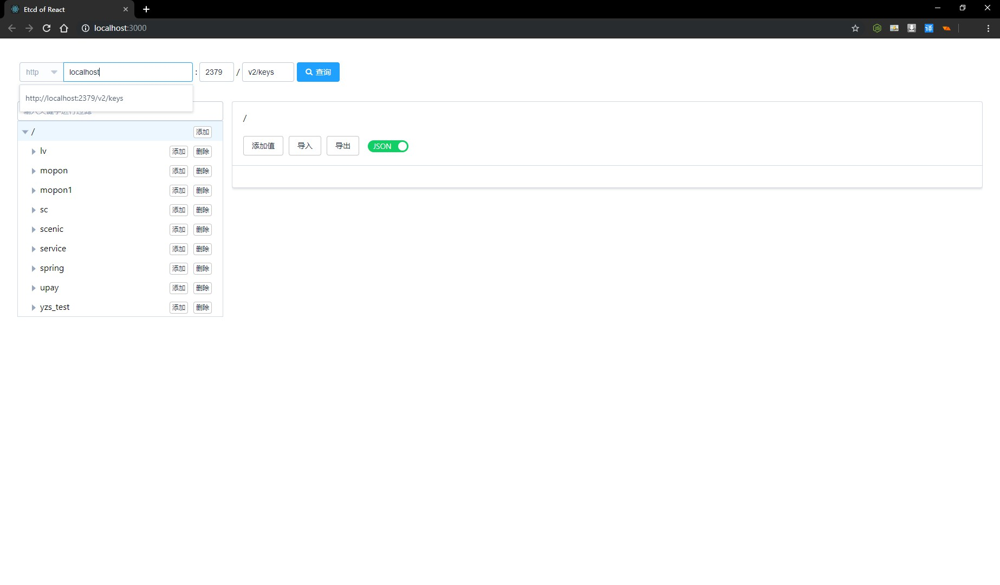
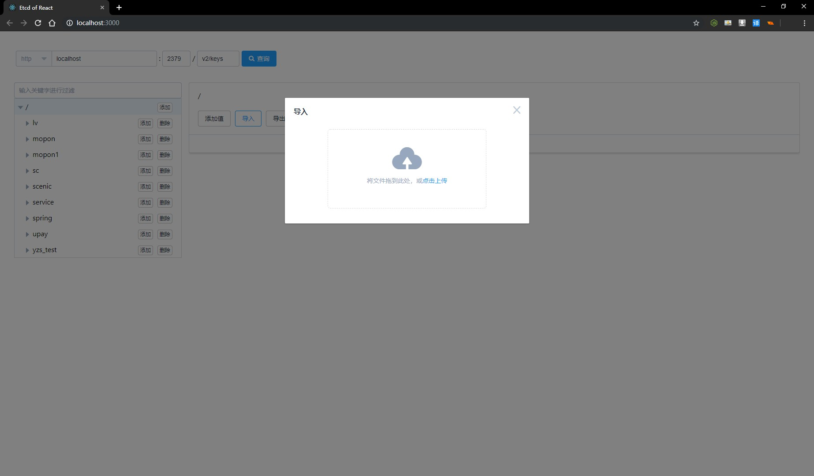
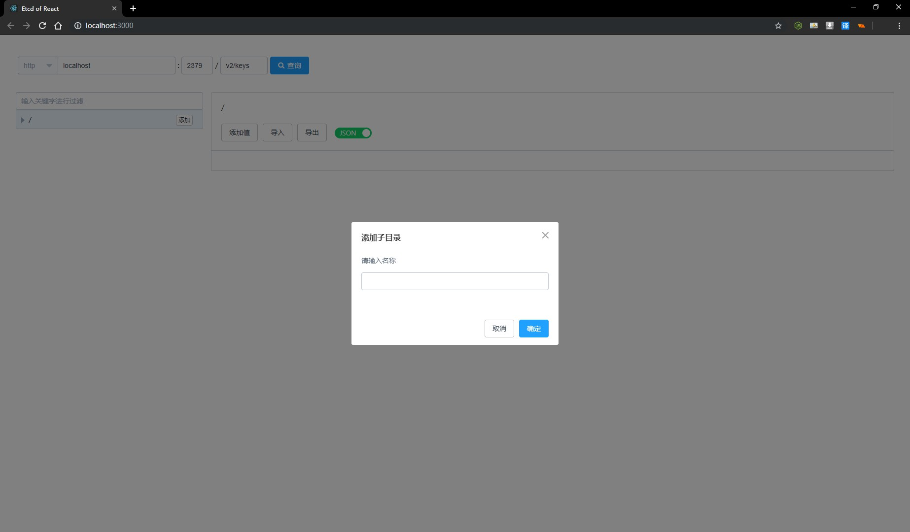
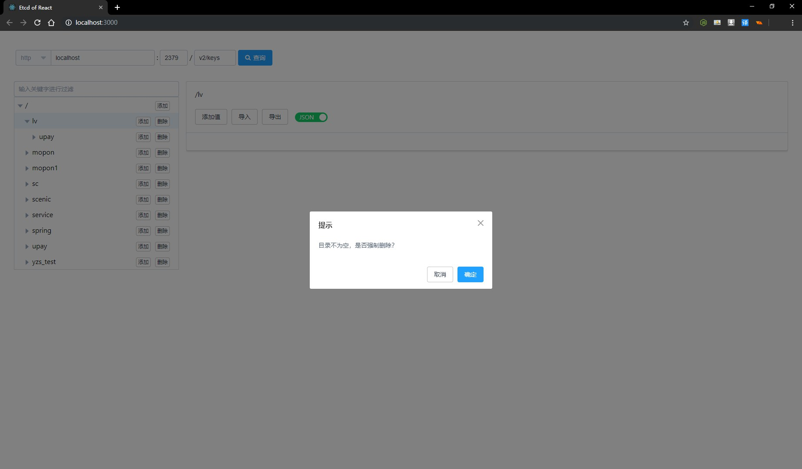
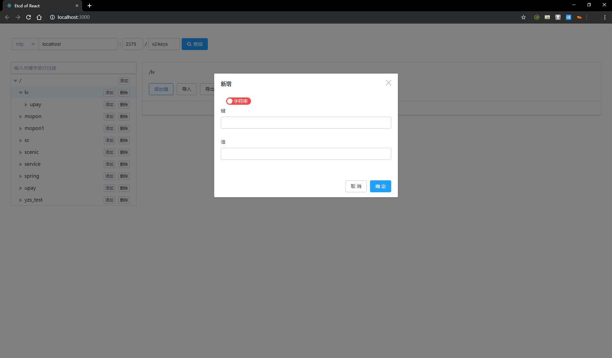
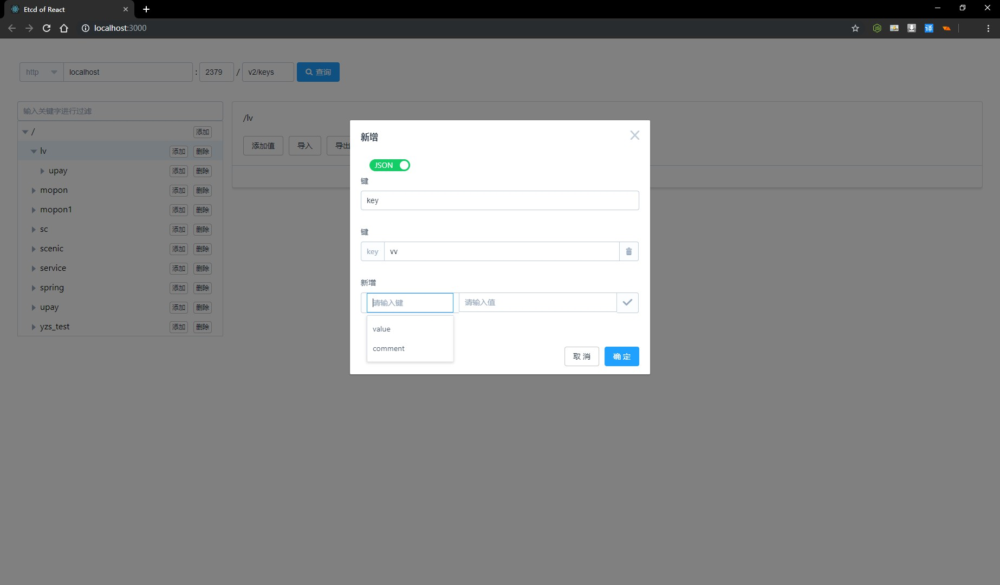
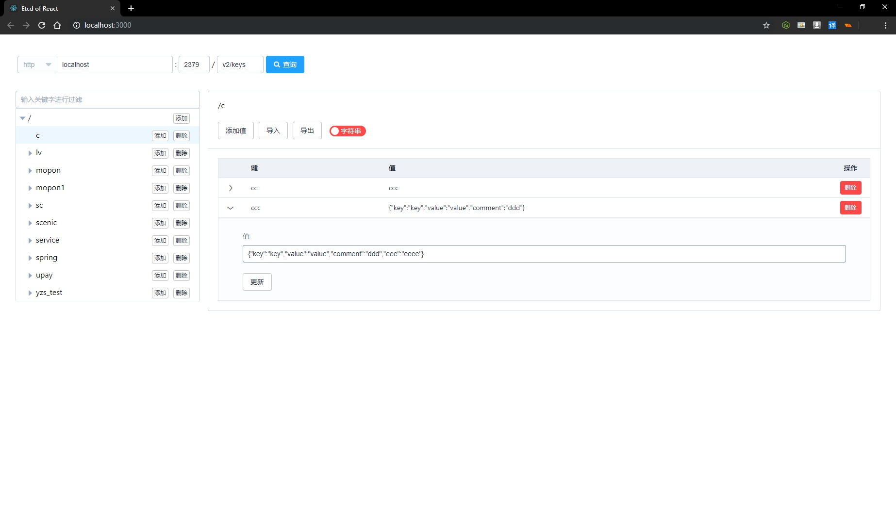
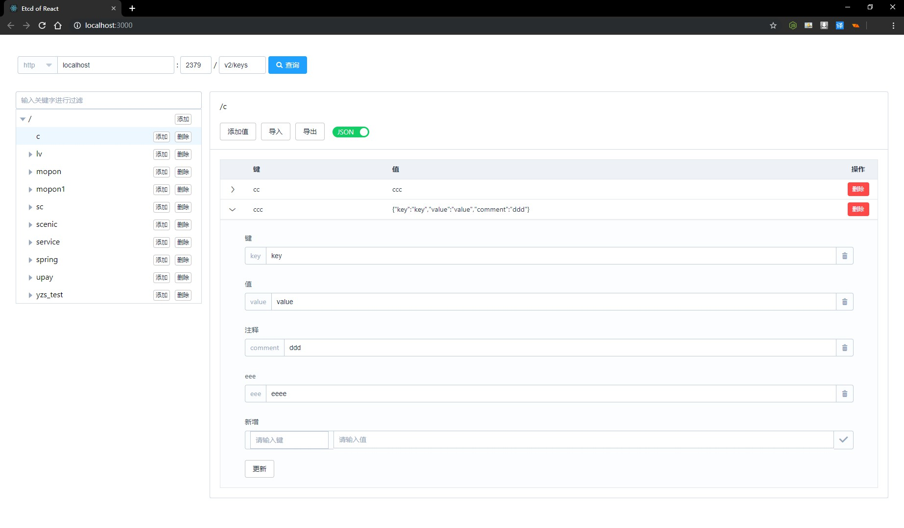

# Etcd Of React

ETCD v2 的 Web管理工具，不依赖后台

只需要一个服务器（express or nginx）部署静态项目并代理转发请求，处理跨域

## 使用步骤

脚本和配置文件见 lib

1. yarn && yarn build

2. 修改 public\config.json，然后执行 proxy.cmd / proxy.sh

3. http://localhost:404

## Express 代理

执行 proxy.cmd or proxy.sh

## Nginx 代理配置
见 nginx.conf

## 界面展示

### 主页

### 导入

### 添加目录

### 删除目录

### 添加值-字符串

### 添加值-json

### 值预览-json

### 值预览-json-展开

